Ellie's Log
========================================================
My daughter, ellie, was born in January. Since her birth, we have been keeping detailed records of her sleep, feeding and diapers. In honor of QS2012, I digitized our log and have put together some plots of the key variables that we measured. I would love ideas and feedback on where to go next. 

changes made as a test. 

<a href="http://imgur.com/4OQqA"></a>


```r
# setwd('~/Desktop/Dropbox/EllieLog/')
require(ggplot2)
```

```
## Loading required package: ggplot2
```

```r
require(reshape2)
```

```
## Loading required package: reshape2
```

```r

# read in log data
Ellielog = read.csv("Ellielog2.csv")

# reformat dates
dates = seq(from = as.Date("2012-01-19"), to = as.Date("2012-10-18"), by = "day")
Ellielog$Date = dates

# create age in days variate
Ellielog$age = as.numeric(Ellielog$Date - Ellielog$Date[1])

# read in weight data
EllieWeight = read.csv("ellieWeight.csv")
names(EllieWeight)[1] = "Date"
EllieWeight$Date = as.Date(EllieWeight$Date)

# merge weight data into log
Ellielog = merge(Ellielog, EllieWeight[, c(1, 4)], all.x = TRUE, all.y = TRUE)

# manual additions of weigh ins excluded from chart
Ellielog$weight.lb[1] = 7.5
Ellielog$weight.lb[2] = 7
Ellielog$weight.lb[3] = 6.75
Ellielog$weight.lb[4] = 6.9375
Ellielog$weight.lb[5] = 6.9375
Ellielog$weight.lb[8] = 7 + 5/16
Ellielog$weight.lb[16] = 7 + 15.5/16

# getting the 50th perctile for weight from CDC equations
cdcCoefs = c(3.23249, 0.764466, -0.0115107, -0.000912367)
cdc50 = function(coef, age.in.days) {
    ageM = age.in.days/30.4368
    weight.kg = coef[1] + coef[2] * ageM + coef[3] * ageM^2 + coef[4] * ageM^3
    weight.lb = weight.kg * 2.2
    return(weight.lb)
}
Ellielog$percentile50 = cdc50(cdcCoefs, 1:dim(Ellielog)[1])

# create the melted Ellielog
Ellielog.melt = melt(Ellielog, id.vars = "Date")
```

## Weight

```r
qplot(Date, value, data = subset(Ellielog.melt, variable %in% c("weight.lb", 
    "percentile50")), color = variable) + labs(y = "pounds", color = "") + scale_color_hue(h.start = 180)
```

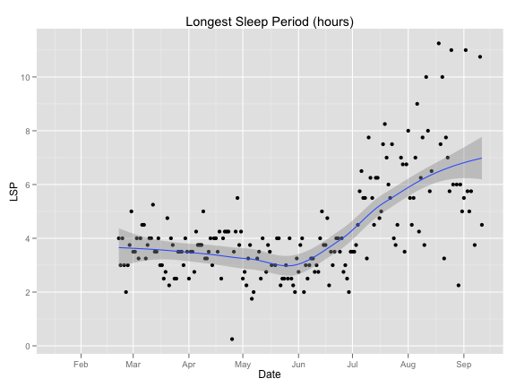 


```r
qplot(Date, value, data = subset(Ellielog.melt, variable %in% c("weight.lb", 
    "percentile50") & Date < Ellielog$Date[100]), color = variable, main = "zoom in on first 100 days") + 
    annotate("segment", y = -Inf, yend = Inf, x = 15422, xend = 15422, color = "limegreen", 
        lty = 2) + labs(y = "pounds", color = "") + scale_color_hue(h.start = 180) + 
    annotate("text", x = 15432, y = 8.25, label = "start meds", color = "limegreen")
```

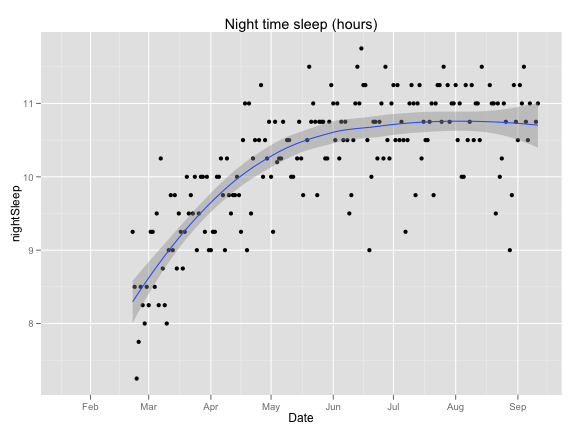 

## Sleep

```r
qplot(Date, LSP, data = Ellielog, geom = c("point", "smooth"), main = "Longest Sleep Period (hours)")
```

```
## geom_smooth: method="auto" and size of largest group is <1000, so using
## loess. Use 'method = x' to change the smoothing method.
```

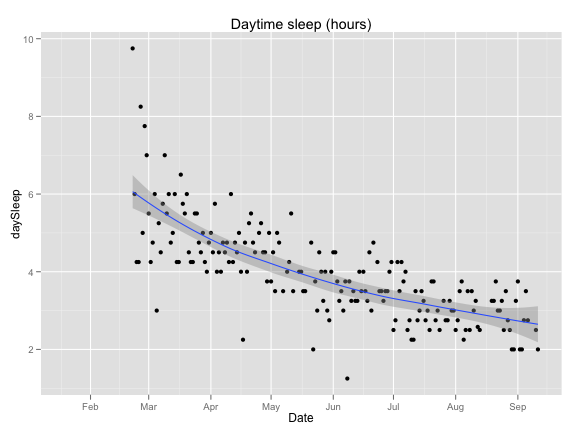 


```r
qplot(Date, nightSleep, data = Ellielog, geom = c("point", "smooth"), main = "Night time sleep (hours)")
```

```
## geom_smooth: method="auto" and size of largest group is <1000, so using
## loess. Use 'method = x' to change the smoothing method.
```

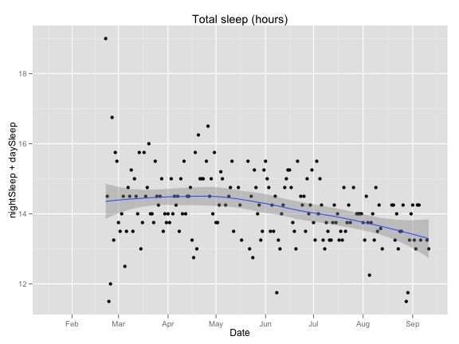 


```r
qplot(Date, daySleep, data = Ellielog, geom = c("point", "smooth"), main = "Daytime sleep (hours)")
```

```
## geom_smooth: method="auto" and size of largest group is <1000, so using
## loess. Use 'method = x' to change the smoothing method.
```

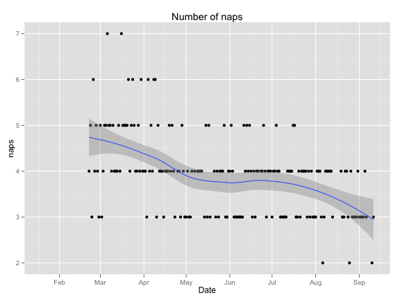 


```r
qplot(Date, nightSleep + daySleep, data = Ellielog, geom = c("point", "smooth"), 
    main = "Total sleep (hours)")
```

```
## geom_smooth: method="auto" and size of largest group is <1000, so using
## loess. Use 'method = x' to change the smoothing method.
```

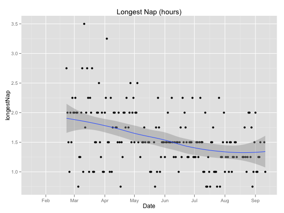 


```r
qplot(Date, naps, data = Ellielog, geom = c("point", "smooth"), main = "Number of naps")
```

```
## geom_smooth: method="auto" and size of largest group is <1000, so using
## loess. Use 'method = x' to change the smoothing method.
```

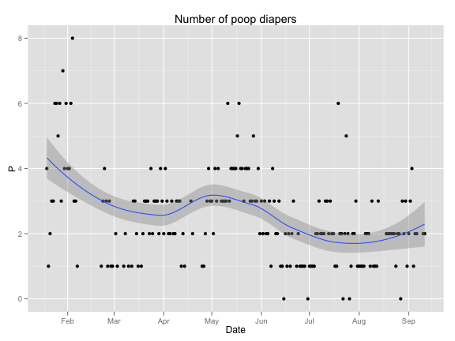 


```r
qplot(Date, longestNap, data = Ellielog, geom = c("point", "smooth"), main = "Longest Nap (hours)")
```

```
## geom_smooth: method="auto" and size of largest group is <1000, so using
## loess. Use 'method = x' to change the smoothing method.
```

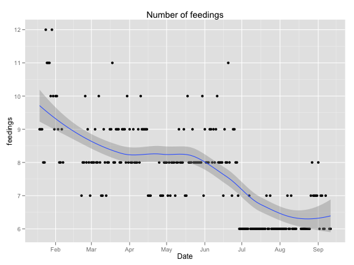 


```r
qplot(nightSleep, daySleep, data = Ellielog, color = age) + annotate("segment", 
    x = 7, y = 7.5, xend = 12, yend = 2.5, lty = 2) + scale_color_gradient(low = "pink", 
    high = "red") + annotate("text", x = 7.5, y = 7.45, label = "14.5 hour line", 
    srt = 338) + labs(color = "age in days")
```

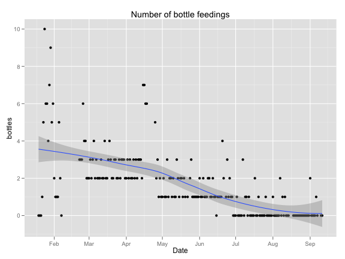 


## Diapers

```r
qplot(Date, P, data = Ellielog, geom = c("point", "smooth"), main = "Number of poop diapers")
```

```
## geom_smooth: method="auto" and size of largest group is <1000, so using
## loess. Use 'method = x' to change the smoothing method.
```

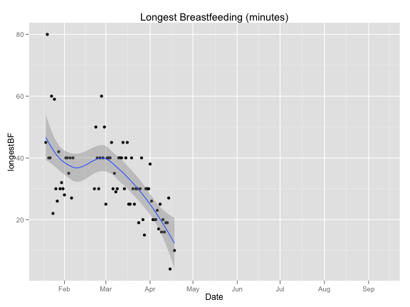 


## Feedings

```r
qplot(Date, longestBF, data = Ellielog, geom = c("point", "smooth"), main = "Longest Breastfeeding (minutes)")
```

```
## geom_smooth: method="auto" and size of largest group is <1000, so using
## loess. Use 'method = x' to change the smoothing method.
```

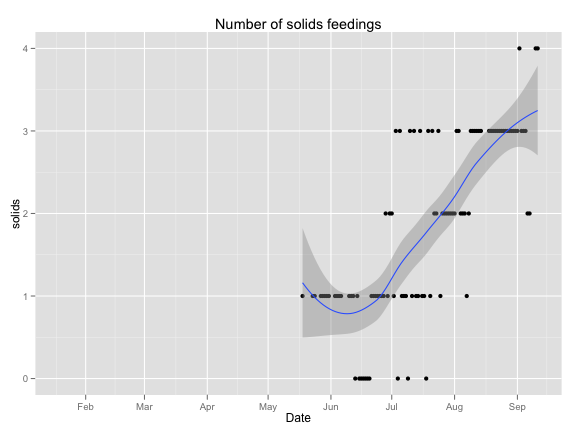 


```r
Ellielog$longestBF[-c(1:88)] = 10
qplot(Date, feedings, data = Ellielog, geom = c("point", "smooth"), main = "Number of feedings", 
    size = longestBF)
```

```
## geom_smooth: method="auto" and size of largest group is <1000, so using
## loess. Use 'method = x' to change the smoothing method.
```

 


```r
qplot(Date, bottles, data = Ellielog, geom = c("point", "smooth"), main = "Number of bottle feedings")
```

```
## geom_smooth: method="auto" and size of largest group is <1000, so using
## loess. Use 'method = x' to change the smoothing method.
```

 


```r
qplot(Date, longestBF, data = Ellielog, geom = c("point", "smooth"), main = "Longest Breastfeeding (minutes)")
```

```
## geom_smooth: method="auto" and size of largest group is <1000, so using
## loess. Use 'method = x' to change the smoothing method.
```

 


```r
qplot(Date, solids, data = Ellielog, geom = c("point", "smooth"), main = "Number of solids feedings")
```

```
## geom_smooth: method="auto" and size of largest group is <1000, so using
## loess. Use 'method = x' to change the smoothing method.
```

 


<a href="http://imgur.com/bFLFG"></a>
